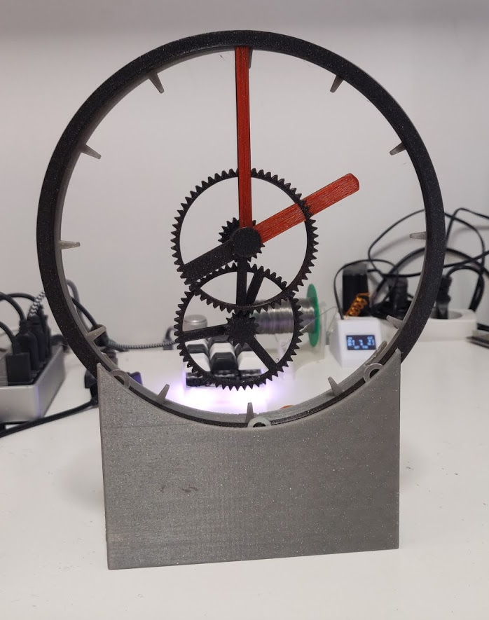
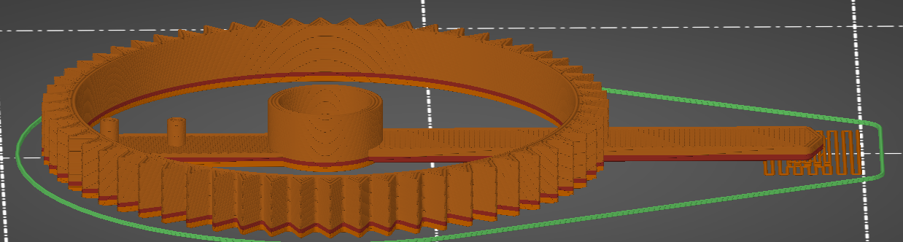
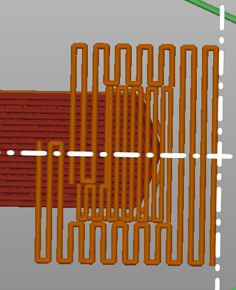
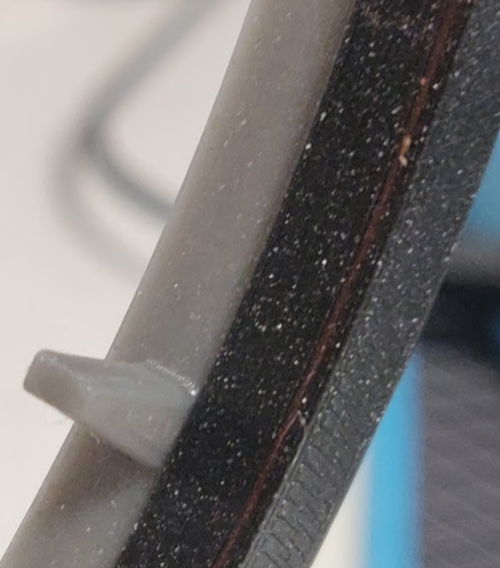

# levitating_clock_color
A modified set of arms for the levitating hollow-clock design. It has the front face of the arms recessed to allow a normal printer to print those layers in a different color

## GUIDE: How to print the dual-color arms

These modified parts are made to be printed on a normal single color printer,
while still allowing the arms to be a different color.
This is done by recessing the front face of the arms a tiny amount (0.6mm) allowing a few layers to be printed first,
covering the different colored layer, except for where the arms are.
This works best with dark colors as the covering plastics, as lighter colors might not fully cover the colored layer in just 0.6mm

To print this, simply insert an [M600](https://reprap.org/wiki/G-code#M600:_Filament_change_pause) at the layer where the indiciators will be printed.
Print at least 3 layers of the arm color, before switching back to the normal color with another M600 (if you want to switch back)

In my case I used Prusa Slic3r, which has a button to add color changes in the g-code preview  

The hour hand also needs a bit of support at the tip, and it's important
that the support here runs perpendicular to the first layer of the hour hand. Easiest way to do this is just to rotate the print.

The minute hand doesn't need support. It's supported on both ends.

As the layers of the hands are only 0.6mm above the bed, the bridging doesn't really have to be good. It just needs to stick at both ends. 

When printed (3x0.15mm layers) it's barely visible in the non-exposed parts of the print

